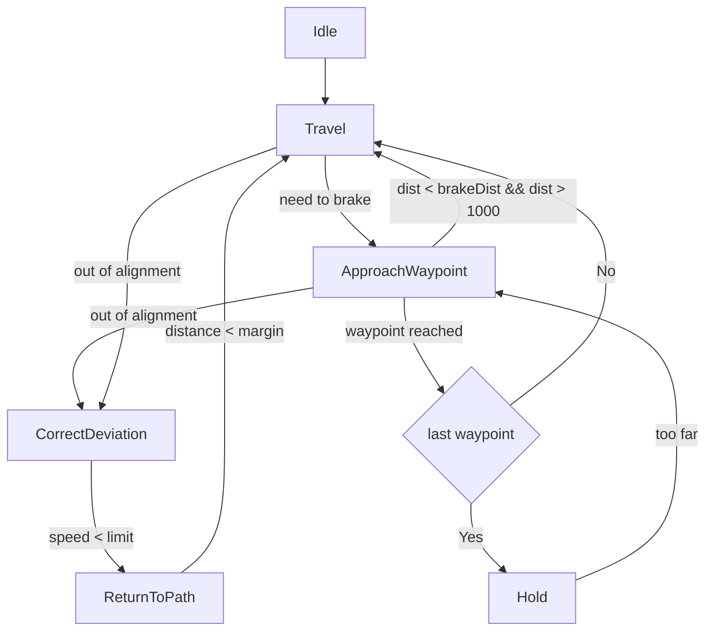

# Todo

* Alternating between ApproachWaypoint and CorrectDeviation/ReturnToPath results in not enough brake.
* Loading/Saving route untested
* Add unit tests for route point
* Add unit tests for point options
* Add unit tests for route
* Add unit tests for route controller
* Can we float down on brakes instead of using engines to counter acceleration?

# Brakes

- Does enabling brakes cause up/down movement? They do!

# Flight

# Cross and dot

Right hand rule for cross product:

* Point right flat hand in direction of first arrow
* Curl fingers in direction of second.
* Thumb now point in direction of the resulting third arrow.

  a.b = 0 when vectors are orthogonal.
  a.b = 1 when vectors are parallel.
  axb = 0 when vectors are parallel.